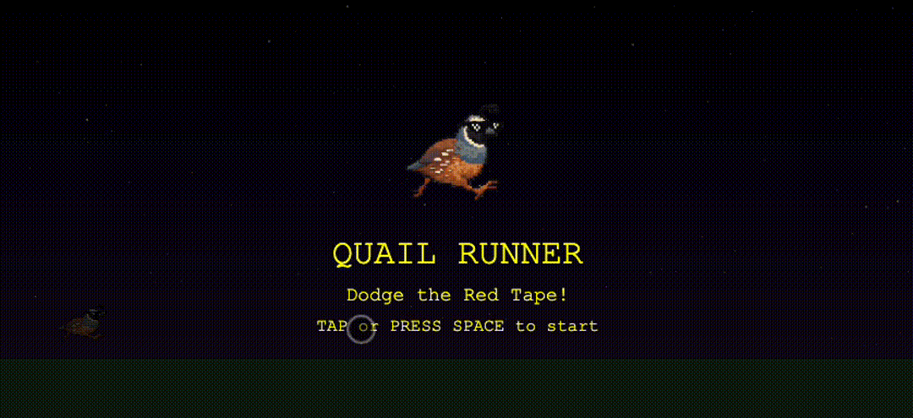

# Quail Runner

A Chrome dino runner-style game built with Kaplay.js, optimized for iPhone 15 landscape play.

## Game Features

### Core Mechanics
- **Tap screen or spacebar**: Make the quail jump
- **Hold spacebar**: Charge up a mega jump (yellow charge bar appears)
- **Double tap**: Perform a double jump while in the air
- **Neon purple trail**: Appears behind the quail while running

### Enemies
- **Red cassette tapes**: Represent government red tape that contractors must navigate
- Spawn at random intervals and scroll from right to left
- Collision with cassettes ends the game

### Special Effects
- **US Flag confetti**: Appears when successfully jumping over enemies (🇺🇸)
- **Toasty moment**: After jumping over 3 enemies, the toasty-botts image appears in the upper right with "TOASTY!" text
- **Progressive difficulty**: Game speed increases over time

### Scoring
- +10 points for each enemy successfully jumped over
- Score and current speed displayed in the top left

### Display Optimization
- Designed for iPhone 15 landscape orientation (932x430 pixels)
- Responsive canvas that scales to fit screen
- Touch-friendly controls for mobile play

## Controls
- **Spacebar/Tap**: Jump
- **Hold Spacebar**: Charge mega jump
- **Double Tap/Press**: Double jump (only available after first jump)

## Technical Implementation
- Built with Kaplay.js game engine
- Static HTML5 application
- No external dependencies beyond Kaplay.js CDN
- Uses SVG sprites for game objects
- Optimized for mobile touch input

## Running the Game
1. Open `index.html` in a web browser
2. For best experience, rotate phone to landscape mode (iPhone 15)
3. Tap or press spacebar to start

## Game Assets
- Quail sprites: Provided by user (currently using placeholder SVG)
- Toasty-botts image: Provided by user
- Cassette tape sprites: Generated SVG representing red tape
